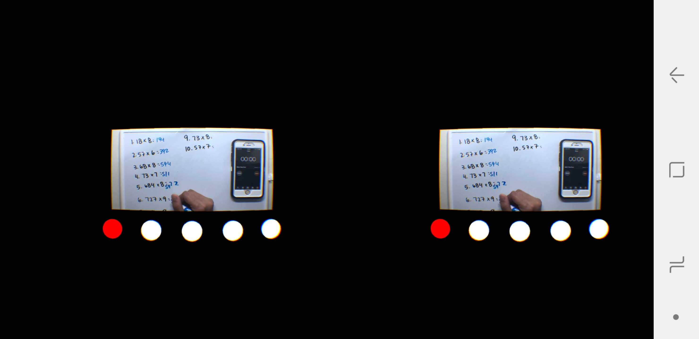

# VRClassroom
This is the project Template for a Virtual Reality Classroom

## API
Using the samsung gear vr api

1.The sxr documentation by samsung is not fully available to use.

2.Made a video template for the classroom, which can be integrated with a 3d model to experience a classroom in VR.

3.Made classroom 3D models in Autodesk maya and Sketch up which can be integrated in Unity.


## Getting Started
Follow these steps to create projects for GearVR framework
1. Make a copy of this repo
1. Rename your project by changine the folder name
1. Rename your Android App by updating `app_name` field of [app/src/main/res/values/strings.xml](https://github.com/nitosan/GearVRf-template/blob/master/app/src/main/res/values/strings.xml#L2)
1. Update the `applicationID` in [app/build.gradle](https://github.com/nitosan/GearVRf-template/blob/master/app/build.gradle#L19) to avoid conflict between other GearVR Framework apps.

## Build and Run

### Gear VR
The default setup for template project is for Gear VR, so you don't need to change any project file

Just need to copy your [Oculus signature file](https://developer.oculus.com/osig/) to `app/src/main/assets` folder.

### Screenshot



### DayDream
Perform the following steps to enable DayDream Mode

1. remove following line in `app/build.gradle`

```
compile "org.gearvrf:backend_oculus:$gearvrfVersion"
```

2. comment out following line in `AndroidManifest.xml`

```
<meta-data android:name="com.samsung.android.vr.application.mode" android:value="vr_only"/>
```
